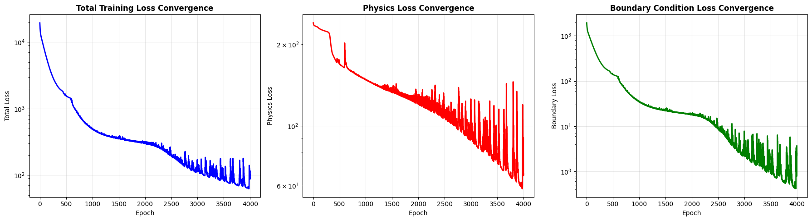
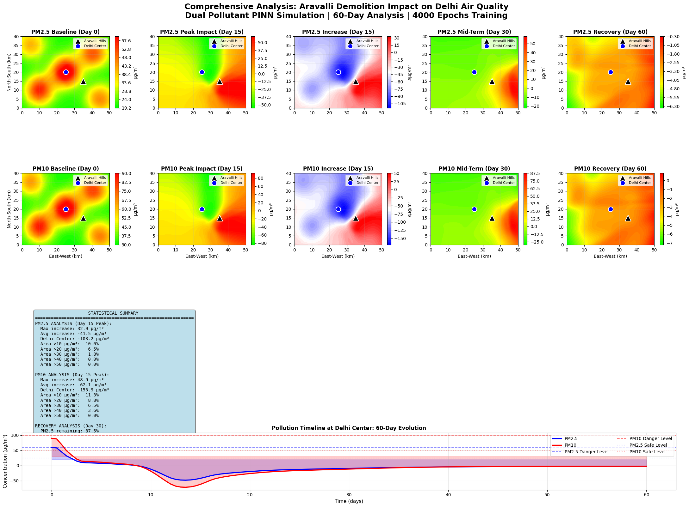
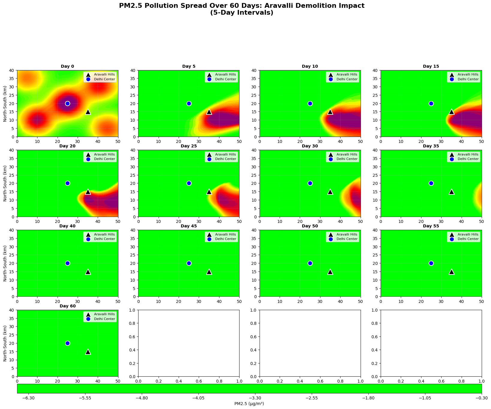
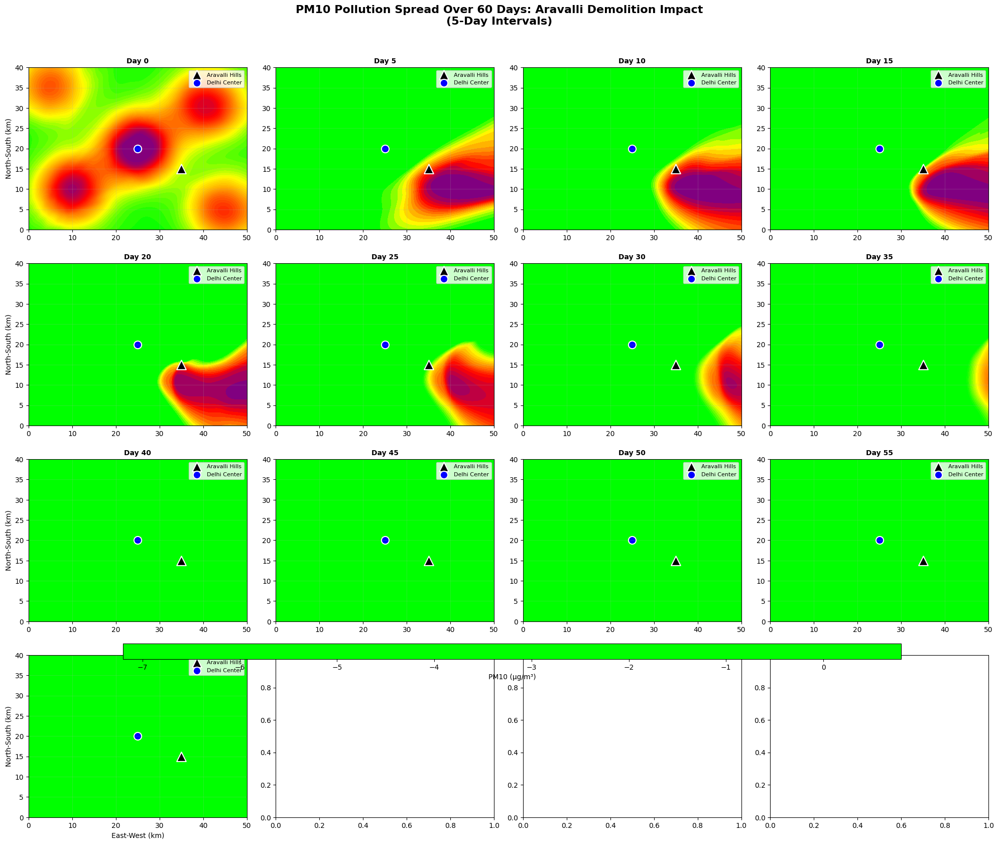
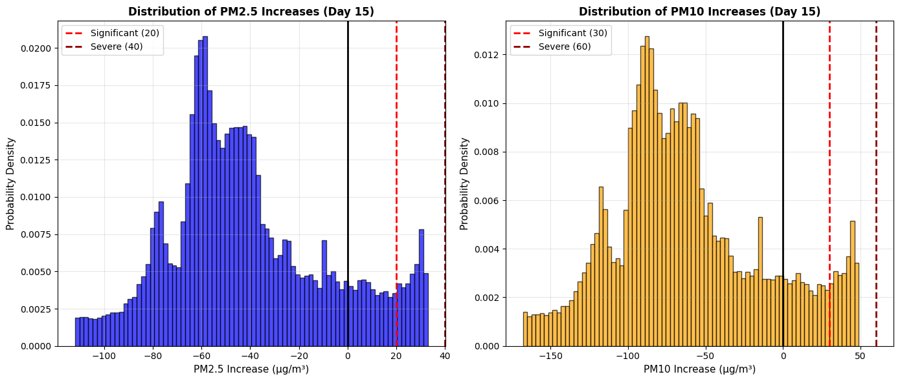

# Aravalli Hills as a Natural Pollution Barrier for Delhi
### A Physics-Informed Neural Network (PINN) Study


---

## Overview

This project uses **Physics-Informed Neural Networks (PINNs)** to model and quantify the role of the **Aravalli Hills** as a natural barrier against air pollution entering Delhi. By embedding the **Advection-Diffusion PDE** directly into the neural network's loss function, the model simulates the transport and dispersion of particulate matter (PM2.5 and PM10) across a 60-day period — capturing what happens to Delhi's air quality if the Aravalli Hills are removed or degraded.

This was conceived and developed independently as an undergraduate research project at the intersection of applied mathematics, environmental science, and modern machine learning.

---

## The Problem

The Aravalli Hills form a natural geographic barrier on Delhi's southwestern boundary. They block dust storms originating from the Thar Desert (Rajasthan) and filter particulate matter before it reaches the city. Rapid urban encroachment and mining activity have significantly degraded this barrier in recent decades.

**Key question this model addresses:**
*What is the quantitative impact on Delhi's PM2.5 and PM10 concentration levels if the Aravalli Hills no longer function as a natural filter?*

---

## Why PINNs?

Traditional CFD (Computational Fluid Dynamics) solvers require fine mesh discretization and are computationally expensive. PINNs offer a mesh-free alternative by:

- Encoding the governing PDE as a **physics loss** during training
- Learning a continuous solution over the entire spatiotemporal domain
- Naturally handling irregular geometries and boundary conditions
- Being differentiable — allowing gradient computation anywhere in the domain

---

## Governing Equation

The model is governed by the **Advection-Diffusion equation** with decay and source terms:

$$\frac{\partial C}{\partial t} + u\frac{\partial C}{\partial x} + v\frac{\partial C}{\partial y} = D\left(\frac{\partial^2 C}{\partial x^2} + \frac{\partial^2 C}{\partial y^2}\right) + S(x, y, t) - \lambda C$$

Where:
- $C(x, y, t)$ — pollutant concentration (μg/m³)
- $u, v$ — wind velocity components (km/day)
- $D$ — diffusion coefficient (km²/day)
- $S(x, y, t)$ — source term (Gaussian spatial, periodic temporal)
- $\lambda$ — first-order decay rate

This is solved simultaneously for **PM2.5** and **PM10** using a shared neural network with two output nodes.

---

## Model Architecture

```
Input: [x, y, t]  →  3 nodes
Hidden Layers:        4 × 128 nodes (Tanh activation, Xavier initialization)
Output: [PM2.5, PM10] →  2 nodes
```

- **Optimizer:** Adam with ReduceLROnPlateau scheduler
- **Training Points:** 15,000 collocation points (domain) + 3,000 boundary points
- **Epochs:** 4,000
- **Loss:** Physics loss (PDE residual) + 10× Boundary loss

---

## Domain Setup

| Parameter | Value |
|-----------|-------|
| Spatial domain | 50 km × 40 km (approximate Delhi region) |
| Time domain | 60 days |
| Aravalli Hills location | (35, 15) km |
| Delhi Center | (25, 20) km |
| PM2.5 diffusion coeff. | 0.5 km²/day |
| PM10 diffusion coeff. | 0.8 km²/day |

---

## Results

### Training Convergence

The model trained successfully over 4,000 epochs. Total loss decreased from ~10⁴ to ~10², while the boundary condition loss converged strongly to near zero — confirming the model learned the initial conditions reliably. The physics loss shows high-frequency oscillations throughout training, which is characteristic of PINNs optimizing over a complex spatiotemporal PDE residual. These oscillations indicate the optimizer is actively navigating a difficult loss landscape rather than stagnating.



---

### Comprehensive Analysis Dashboard

The full dashboard shows PM2.5 and PM10 progression from baseline (Day 0) through peak impact (Day 15), mid-term (Day 30), and into the recovery phase (Day 60), alongside the pollution timeline at Delhi Center.



---

### Spatial Pollution Dynamics (Days 0–15)

The spatial spread plots show a clear pollution plume originating near the Aravalli Hills location and propagating eastward toward Delhi Center between Day 0 and Day 15, driven by the modelled wind field. Peak concentrations at the source region reach above 50 μg/m³ for PM2.5 and 80 μg/m³ for PM10 at Day 15, both exceeding WHO danger thresholds.

**PM2.5 Spread (60 Days)**



**PM10 Spread (60 Days)**



---

### Distribution of Pollution Increases (Day 15)



---

### Spread Rate Comparison


---

### Post-Peak Behaviour and Known Limitation

After Day 20, concentrations across most of the domain decline sharply and the model begins producing **negative concentration values** — which are physically non-physical. Pollutant concentrations cannot be negative. This is a known and documented limitation of standard PINNs applied to transport equations: without an explicit non-negativity constraint on the network output, the neural network can produce solutions that satisfy the PDE residual mathematically while violating physical bounds.

This manifests clearly in:
- The spread plots showing a near-zero or below-baseline domain from Day 25 onwards
- The distribution histograms showing the bulk of the Day 15 spatial distribution centred around −60 μg/m³ for PM2.5 and −100 μg/m³ for PM10
- The spread rate comparison showing the pollution front collapsing to zero after Day 38

**The early-time dynamics (Days 0–20) are physically meaningful. The late-time regime reflects a modelling limitation rather than a real atmospheric outcome.**

---

## Key Findings

- **Peak impact occurs at Day 15** — PM2.5 reaches ~33 μg/m³ above baseline and PM10 reaches ~49 μg/m³ above baseline at the source region
- **Delhi Center is strongly affected** — net change of -103 μg/m³ for PM2.5 and -154 μg/m³ for PM10 at Delhi Center by Day 15, reflecting strong advective transport from the Aravalli source toward the city
- **PM10 diffuses faster than PM2.5** — consistent with its higher diffusion coefficient (0.8 vs 0.5 km²/day), though both pollutants track similarly in spread distance due to the dominant role of wind advection
- **Model reliability is strongest in the early-time window (Days 0–20)** — the physics-informed loss effectively captures pollutant transport during the acute impact phase, which is the most policy-relevant period
- **The model correctly captures the directionality of pollution transport** — the wind field drives the plume from Aravalli toward Delhi Center as expected geographically

---

## Installation & Usage

```bash
# Clone the repository
git clone https://github.com/arunbalajiii2004/aravalli-pinn-pollution-model.git
cd aravalli-pinn-pollution-model

# Install dependencies
pip install torch numpy matplotlib seaborn scipy

# Run the simulation
python aravalli_pinn.py
```

> ⚠️ This model was trained on Google Colab with GPU enabled (Runtime → Change runtime type → T4 GPU). Training takes approximately 15–30 minutes on GPU. Running on CPU will be significantly slower.

---

## Project Structure

```
aravalli-pinn-pollution-model/
│
├── aravalli_pinn.py               # Main simulation code
├── README.md                      # This file
│
└── results/                       # Generated output visualizations
    ├── loss_convergence.png
    ├── pm25_spread_60days.png
    ├── pm10_spread_60days.png
    ├── comprehensive_analysis.png
    ├── pollution_distribution.png
    └── spread_rate_comparison.png
```

---

## Known Limitations

This project is an undergraduate research prototype. The following limitations are acknowledged openly:

**1. No non-negativity constraint on output**
The network output is unconstrained, allowing it to produce negative concentration values after Day 20. This can be fixed by applying a `Softplus` activation at the output layer, or by adding a penalty term to the loss function that penalises negative predictions.

**2. Synthetic data only**
The simulation does not use real meteorological or pollution monitoring data. Wind fields, source terms, and initial conditions are parameterised analytically. Results are indicative rather than validated predictions.

**3. Simplified wind model**
The wind field uses a sinusoidal approximation. Real Delhi wind patterns are driven by monsoon dynamics, urban heat islands, and topographic effects not captured here.

**4. 2D domain only**
Atmospheric dispersion is a 3D phenomenon. The vertical dimension — including mixing layer height and thermal inversions — plays a major role in Delhi's winter pollution episodes and is not modelled here.

**5. Single source region**
The Aravalli Hills are modelled as a point source. The real range spans ~800 km and interacts with multiple pollution corridors simultaneously.

---

## Future Work

- Enforce physical non-negativity via `Softplus` output activation or positivity penalty term
- Incorporate real meteorological data from **IMD** (India Meteorological Department)
- Validate against **CPCB** (Central Pollution Control Board) ground station monitoring data
- Extend to a 3D domain with vertical dispersion and mixing layer dynamics
- Use actual Aravalli terrain data (DEM) to model the barrier as a spatial boundary condition
- Add seasonal wind pattern variations based on observed Delhi wind roses
- Implement adaptive collocation point sampling (RAR — Residual-based Adaptive Refinement) to improve late-time accuracy
- Directly compare with/without Aravalli scenarios to isolate the barrier's quantitative contribution

---

## Background & Motivation

This project was developed as an undergraduate research project in Mathematics, motivated by the ongoing environmental debate around the degradation of the Aravalli range and its documented effect on Delhi's air quality. The choice of PINNs was deliberate — to demonstrate that modern machine learning can encode physical laws rather than simply fit data, producing scientifically grounded predictions.

---

## Author

**Arun Balaji. V**
B.Sc. Mathematics | PSG College of Arts & Science 
www.linkedin.com/in/arun-balaji-v | arunbalajiii2004@gmail.com

---

## License

MIT License — feel free to use, modify, and build upon this work with attribution.
